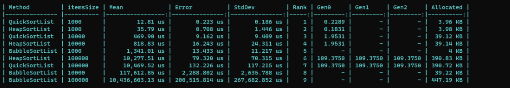

# HomeworkAssignment

## Overview

This repository contains the code and related files for the .NET homework assignment. The purpose of this assignment is to create a sorting API.

### Prerequisites

Ensure that you have .NET 8 SDK installed on your machine:

- [.NET SDK](https://dotnet.microsoft.com/download)

### Benchmarks

During this home assignment, a benchmark for different sorting algorithms was created to measure they performance against each over. This benchmark, consists of 3 sorting algorithms. Those algorithms are QuickSort, HeapSort and BubbleSort. They were benchmarked on different array sizes (1000, 10000, 10000). During these benchmarks QuickSort and HeapSort algorithms were much faster compared to BubbleSort algorithm. QuickSort and HeapSort were faster at sorting array's of item of size 10000 compared to Bubble sort which took longer to sort 1000 items.
